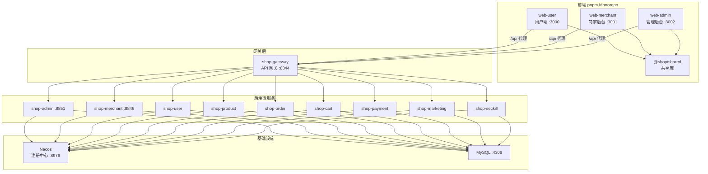
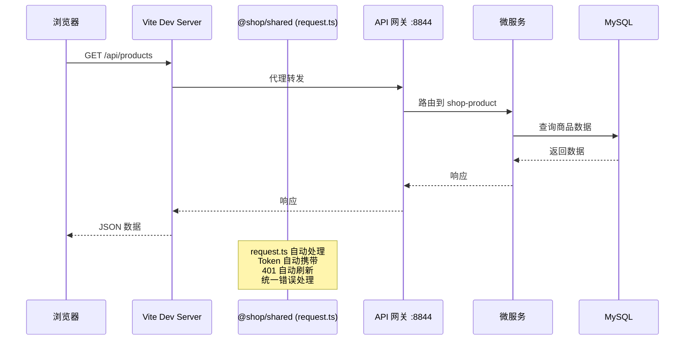
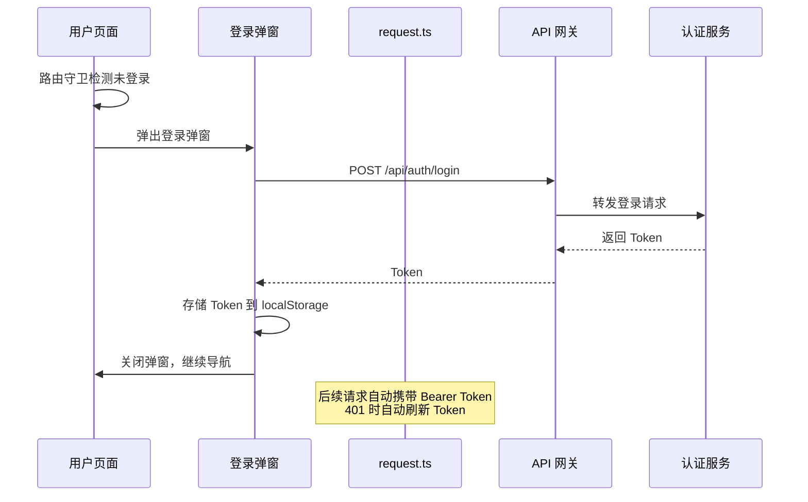
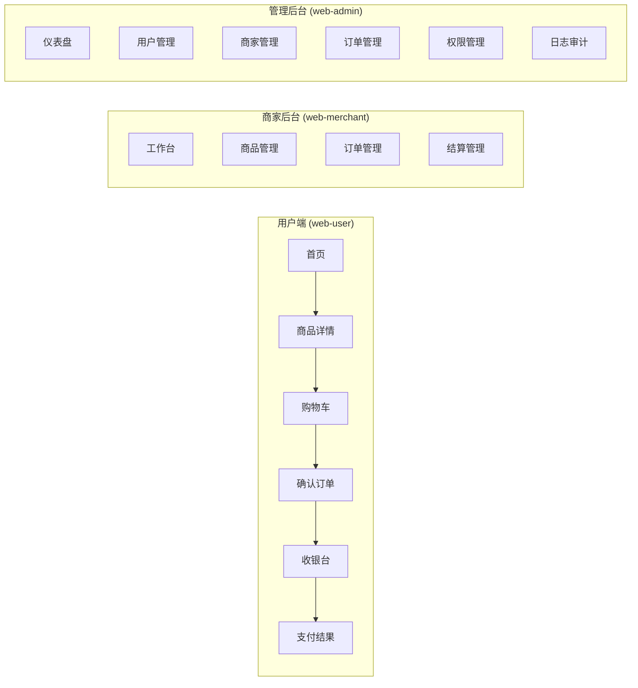

# 系统架构

## 概述

Shop 商城系统是一个基于微服务架构的 B2C 电商平台，前端采用 Vue 3 技术栈的 pnpm monorepo 架构，后端基于 Spring Cloud Alibaba 微服务体系。系统面向消费者、商家和管理员三类用户，提供商品浏览、购物下单、商家入驻、后台管理等完整的电商功能。

## 技术栈

**前端**
- Vue 3.5 (Composition API)
- TypeScript
- Vite 5/6
- Vue Router 4
- Pinia (状态管理)
- Element Plus 2.8/2.9
- ECharts (管理后台图表)
- Axios (HTTP 客户端)
- pnpm (包管理 + workspace)

**后端**
- Java 17 + Spring Boot 3
- Spring Cloud Alibaba (Nacos 注册中心)
- MyBatis-Plus (ORM)
- MySQL 8
- Sa-Token (认证授权)
- OpenFeign (微服务调用)
- SpringDoc OpenAPI

**基础设施**
- Docker Compose (本地开发)
- Nacos (注册中心, 端口 8976)
- MySQL (端口 4306)
- API 网关 (端口 8844)

## 项目结构

```
shop/
├── shop-frontend/           # 前端 monorepo
│   ├── packages/
│   │   ├── shared/          # 共享库 (@shop/shared)
│   │   ├── web-user/        # 用户端商城 (port 3000)
│   │   ├── web-merchant/    # 商家后台 (port 3001)
│   │   └── web-admin/       # 管理后台 (port 3002)
│   ├── package.json         # 根 workspace 配置
│   ├── pnpm-workspace.yaml
│   └── tsconfig.base.json
│
├── shop-gateway/            # API 网关 (port 8844)
├── shop-admin/              # 管理后台服务 (port 8851)
├── shop-merchant/           # 商家服务 (port 8846)
├── shop-user/               # 用户服务
├── shop-product/            # 商品服务
├── shop-order/              # 订单服务
├── shop-cart/               # 购物车服务
├── shop-payment/            # 支付服务
├── shop-marketing/          # 营销服务
├── shop-seckill/            # 秒杀服务
├── shop-common/             # 公共模块
├── shop-model/              # 数据模型
├── docker-compose.yml
└── pom.xml                  # Maven 父工程
```

**前端入口点**
- `shop-frontend/packages/web-user/src/main.ts` — 用户端入口
- `shop-frontend/packages/web-merchant/src/main.ts` — 商家后台入口
- `shop-frontend/packages/web-admin/src/main.ts` — 管理后台入口
- `shop-frontend/packages/shared/src/index.ts` — 共享库导出入口

## 子系统

### 共享层 (@shop/shared)

**目的**: 为三个前端应用提供统一的类型定义、API 请求层、工具函数和组合式函数。

**位置**: `shop-frontend/packages/shared/src/`

**关键文件**: `api/request.ts`, `types/index.ts`, `utils/auth.ts`, `composables/useAuth.ts`

**依赖**: axios, Vue 3

**被依赖**: web-user, web-merchant, web-admin

### 用户端 (web-user)

**目的**: 面向消费者的商城前台，提供商品浏览、搜索、购物车、下单、支付等核心购物体验。

**位置**: `shop-frontend/packages/web-user/src/`

**关键文件**: `views/home/IndexView.vue`, `views/cart/IndexView.vue`, `views/order/ConfirmView.vue`, `stores/user.ts`

**路由数**: 22 个

**依赖**: @shop/shared, Vue Router, Pinia, Element Plus

### 商家后台 (web-merchant)

**目的**: 面向入驻商家的管理后台，提供商品管理、订单处理、营销活动、店铺设置、数据统计等功能。

**位置**: `shop-frontend/packages/web-merchant/src/`

**关键文件**: `views/dashboard/IndexView.vue`, `views/product/EditView.vue`, `stores/merchant.ts`

**路由数**: 14 个

**依赖**: @shop/shared, Vue Router, Pinia, Element Plus

### 管理后台 (web-admin)

**目的**: 面向平台管理员的综合管理后台，提供用户管理、商家管理、商品管理、权限管理、日志审计等功能。

**位置**: `shop-frontend/packages/web-admin/src/`

**关键文件**: `views/dashboard/index.vue`, `layouts/AdminLayout.vue`, `stores/admin.ts`, `directives/permission.ts`

**路由数**: 23 个

**依赖**: @shop/shared, Vue Router, Pinia, Element Plus, ECharts

### API 网关 (shop-gateway)

**目的**: 统一的 API 入口，负责路由转发和请求统一处理。

**位置**: `shop-gateway/`

**端口**: 8844

**被依赖**: 所有前端应用通过 Vite 代理 `/api` → `localhost:8844`

## 架构图

### 系统整体架构



### 前端请求流程



### 前端认证流程



### 前端页面间数据流



## 设计决策

### pnpm monorepo 架构

前端采用 pnpm workspace 管理三个独立应用和一个共享库。共享库 `@shop/shared` 通过 workspace 协议被三个应用依赖，无需发布到 npm 注册中心。这确保了 API 层、类型定义和工具函数在所有应用间保持一致性。

### Vite 开发代理

所有前端应用通过 Vite 的 `server.proxy` 配置将 `/api` 请求转发到网关 `http://localhost:8844`，避免开发环境下的跨域问题，同时模拟生产环境的部署拓扑。

### 前端 Store 持久化

用户信息、Token、商家信息等关键状态通过 Pinia Store 持久化到 localStorage，页面刷新后状态不丢失。

### 请求层自动 Token 管理

`@shop/shared` 的 `request.ts` 实现了自动 Bearer Token 注入、401 自动刷新（竞态安全）、GET 请求网络错误重试、页面切换时取消未完成请求等机制。
