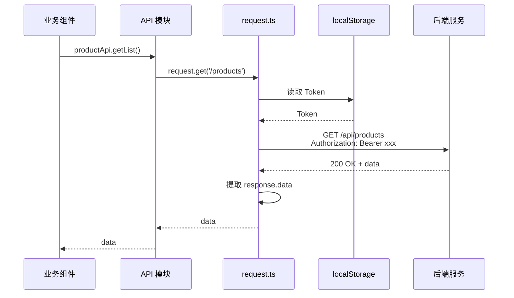

# API 请求层

前端 monorepo 中统一封装的 HTTP 客户端，为三个前端应用提供一致、可靠、安全的网络请求能力。

## 什么是 API 请求层？

基于 Axios 封装的 HTTP 请求实例，集成了认证注入、错误处理、自动重试、请求取消和 XSS 防护等横切关注点，所有前端应用的 API 调用均通过此层发起。

**关键特征**:
- Token 自动注入: 每次请求自动从 localStorage 读取 Token 并注入 Authorization 头
- 401 自动刷新: Token 过期触发自动刷新，竞态安全
- GET 自动重试: GET 请求网络错误自动重试 1 次
- XSS 防护: POST 请求体 HTML 标签自动转义
- 请求取消: 路由切换时自动取消未完成请求
- 统一错误处理: 401/403/500 自动处理并提示
- 错误码映射: 业务错误码到中文描述的映射

## 代码位置

| 方面 | 位置 |
|------|------|
| 核心实现 | `packages/shared/src/api/request.ts` |
| API 模块 | `packages/shared/src/api/modules/` |
| 类型定义 | `packages/shared/src/types/api.ts` |
| 错误码映射 | `packages/shared/src/constants/errorCode.ts` |

## 结构

```typescript
// request.ts 核心结构
const request = axios.create({
  baseURL: '/api',
  timeout: 10000
})

// 请求拦截器
request.interceptors.request.use((config) => {
  // 1. 注入 Bearer Token
  // 2. POST 请求体 HTML 转义
  return config
})

// 响应拦截器
request.interceptors.response.use(
  (response) => {
    // 正常响应直接返回 data
    return response.data
  },
  async (error) => {
    // 1. 处理 401 → 尝试刷新 Token
    // 2. 处理 GET 网络错误 → 自动重试
    // 3. 处理请求取消 → 静默忽略
    // 4. 处理 403/500 → 统一错误提示
    return Promise.reject(error)
  }
)
```

## 请求流程



## 不变量

1. **Token 优先注入**: 所有请求自动注入 Token，无需手动设置
2. **错误统一处理**: 网络错误和认证错误在请求层统一拦截，业务组件只需处理业务错误
3. **竞态安全刷新**: 并发 401 只触发一次 Token 刷新
4. **请求可取消**: 使用 AbortController 在路由切换时自动取消

## 添加新 API 模块

在 `packages/shared/src/api/modules/` 下创建新文件：

```typescript
// modules/example.ts
import request from '../request'
import type { ApiResponse, ExampleType } from '../../types'

export const exampleApi = {
  getList(params?: Record<string, any>) {
    return request.get<ApiResponse<ExampleType[]>>('/api/examples', { params })
  },

  getById(id: string) {
    return request.get<ApiResponse<ExampleType>>(`/api/examples/${id}`)
  },

  create(data: any) {
    return request.post<ApiResponse<ExampleType>>('/api/examples', data)
  }
}
```

然后在 `api/index.ts` 中导出。
