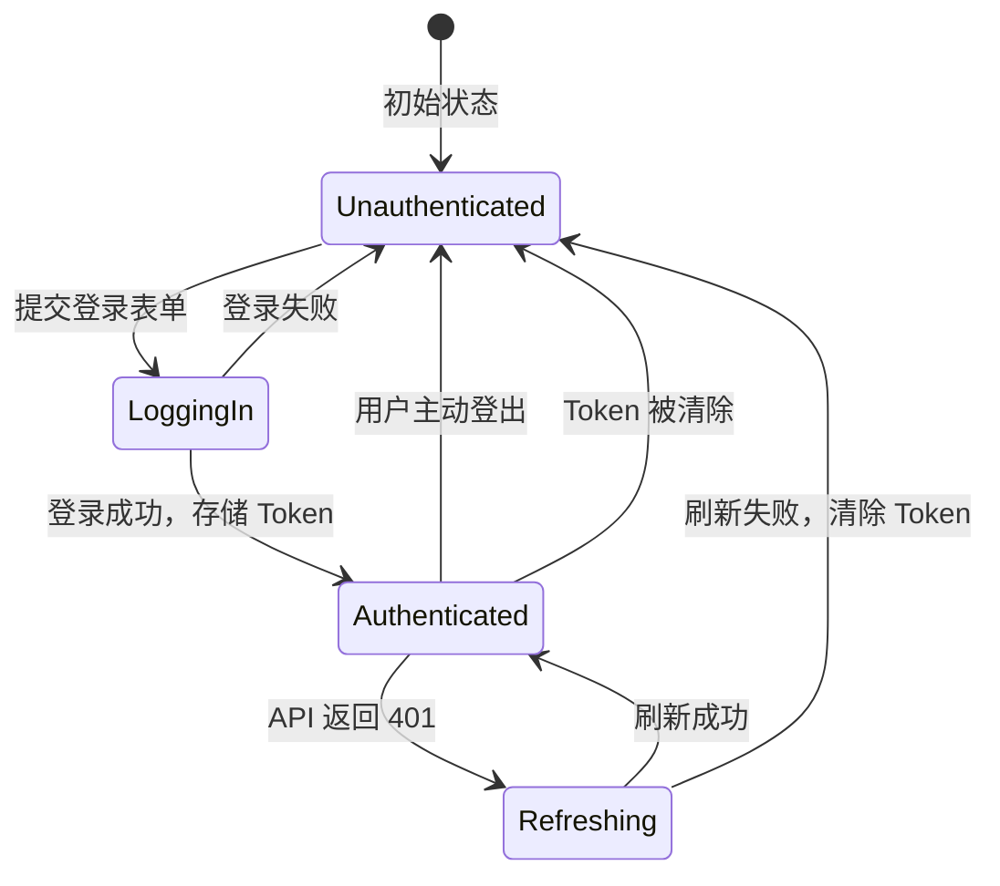
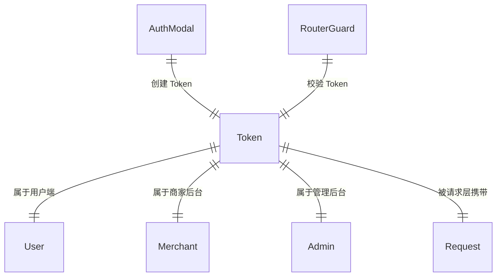

# Token 认证

前端统一的用户身份认证机制，覆盖用户端、商家后台和管理后台三个应用的登录和会话管理。

## 什么是 Token 认证？

前端应用通过 Bearer Token 进行无状态身份认证。用户登录后后端返回 Token，前端存储到 localStorage 并在后续所有 API 请求中自动携带。Token 过期时由请求层自动刷新。

**关键特征**:
- 统一存储: 所有应用的 Token 存储在 localStorage
- 自动携带: request.ts 拦截器自动注入 Authorization 头
- 自动刷新: 401 响应触发 Token 刷新，竞态安全
- 三种角色: 用户 Token、商家 Token、管理员 Token 各自独立

## 代码位置

| 方面 | 位置 |
|------|------|
| Token 工具 | `packages/shared/src/utils/auth.ts` |
| 请求拦截器 | `packages/shared/src/api/request.ts` |
| 用户 Store | `packages/web-user/src/stores/user.ts` |
| 商家 Store | `packages/web-merchant/src/stores/merchant.ts` |
| 管理员 Store | `packages/web-admin/src/stores/admin.ts` |

## 生命周期

### 状态描述

| 状态 | 描述 | 允许的转换 |
|------|------|-----------|
| `unauthenticated` | 未登录，无有效 Token | → loggingIn |
| `loggingIn` | 正在提交登录请求 | → authenticated, unauthenticated |
| `authenticated` | 已登录，Token 有效 | → refreshing, unauthenticated |
| `refreshing` | Token 过期，正在刷新 | → authenticated, unauthenticated |

## Token 刷新竞态安全

当多个 API 请求同时收到 401 时，request.ts 使用以下机制防止重复刷新：

1. 第一个 401 触发 Token 刷新请求
2. 后续 401 检测到正在刷新，等待刷新完成
3. 刷新成功后，所有等待的请求使用新 Token 重试
4. 刷新失败后，所有等待的请求认定为未授权

## 路由守卫

### 用户端
- 未登录访问需登录页面 → 弹出登录弹窗（不跳转）
- 登录成功后自动关闭弹窗继续导航

### 商家后台
- 未登录 → 跳转 `/login?redirect=xxx`
- 已登录但未入驻 → 跳转 `/apply`
- 已入驻访问登录/入驻页 → 跳转 `/dashboard`

### 管理后台
- 未登录 → 跳转 `/login?redirect=xxx`
- 登录成功后恢复原目标页面

## 关系

| 关联概念 | 关系 | 描述 |
|---------|------|------|
| API 请求层 | 被依赖 | 自动从 localStorage 读取并注入 Token |
| 登录组件 | 依赖 | 登录成功后写入 Token |
| 路由守卫 | 依赖 | 根据 Token 存在与否决定导航 |
