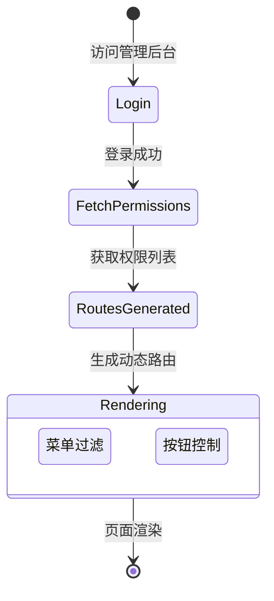
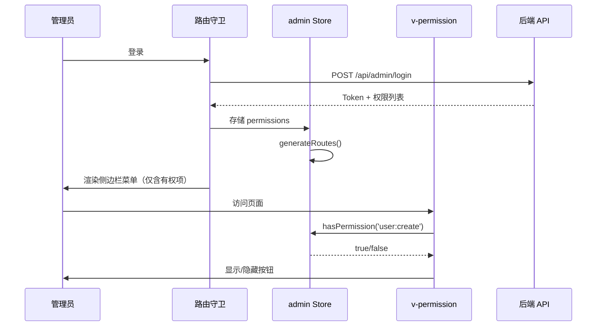
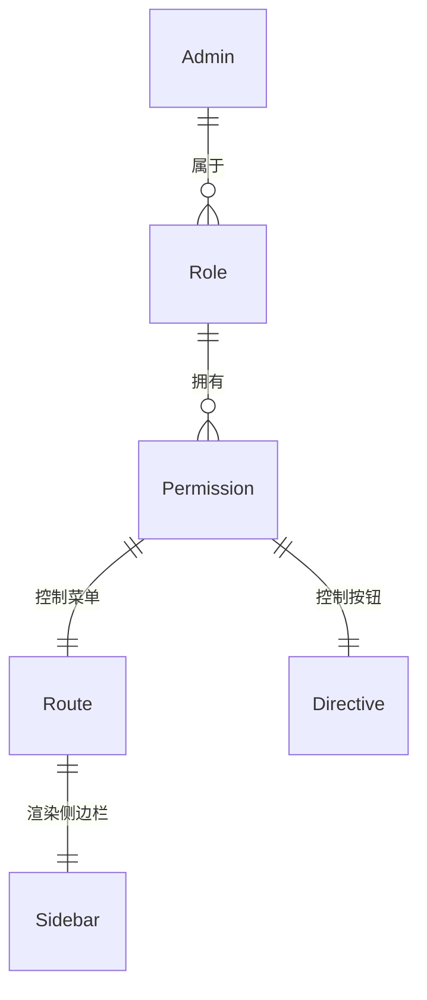

# 权限系统

管理后台专用的 RBAC (Role-Based Access Control) 权限控制体系，实现菜单级和按钮级的细粒度权限管理。

## 什么是权限系统？

管理员后台通过角色-权限模型控制不同管理员可访问的页面和可操作的功能按钮。权限系统由后端定义权限标识，前端通过自定义指令和路由守卫实现双重管控。

**关键特征**:
- 角色基础: 管理员属于角色，角色拥有权限
- 菜单级控制: 无权限的路由不在侧边栏显示
- 按钮级控制: 通过 `v-permission` 指令控制按钮显隐
- 前后端双重校验: 前端 UI 隐藏 + 后端接口鉴权

## 代码位置

| 方面 | 位置 |
|------|------|
| 权限 Store | `packages/web-admin/src/stores/admin.ts` |
| 权限指令 | `packages/web-admin/src/directives/permission.ts` |
| 路由配置 | `packages/web-admin/src/router/index.ts` |
| 后端注解 | `shop-admin/src/main/java/.../annotation/RequirePermission.java` |

## 结构

```typescript
// stores/admin.ts
interface AdminStore {
  token: string | null
  adminInfo: AdminInfo | null
  permissions: string[]           // 权限标识列表
  menus: RouteRecordRaw[]         // 动态路由

  hasPermission(permission: string): boolean
  generateRoutes(): RouteRecordRaw[]
}
```

### 权限标识格式

权限标识使用 `module:action` 格式：
- `user:list` — 用户列表查看
- `user:create` — 创建用户
- `user:edit` — 编辑用户
- `user:delete` — 删除用户
- `order:list` — 订单列表查看
- `system:role:manage` — 角色管理

## 生命周期



### 权限校验流程



## 使用方式

### 菜单级权限

路由配置中声明 `meta.permission`，路由守卫在校验时生成动态菜单：

```typescript
{
  path: '/business/user',
  name: 'UserList',
  component: () => import('@/views/business/UserList.vue'),
  meta: { title: '用户管理', permission: 'user:list' }
}
```

### 按钮级权限

在模板中使用 `v-permission` 指令：

```vue
<template>
  <el-button v-permission="['user:create']" type="primary">
    新增用户
  </el-button>

  <el-button v-permission="['user:edit']">
    编辑
  </el-button>

  <el-button v-permission="['user:delete']" type="danger">
    删除
  </el-button>
</template>
```

`v-permission` 指令逻辑：
1. 元素挂载时读取 `binding.value`（权限标识数组）
2. 从 `adminStore.permissions` 校验
3. 无权限时通过 `el.parentNode.removeChild(el)` 移除元素

## 关系



| 关联概念 | 关系 | 描述 |
|---------|------|------|
| Token 认证 | 前置依赖 | 先登录获取 Token，再获取权限列表 |
| 路由系统 | 被控制 | 权限决定哪些路由可访问 |
| 侧边栏菜单 | 被控制 | 权限决定哪些菜单项显示 |
| 后端注解 | 对应 | 前端权限标识与后端 `@RequirePermission` 注解一致 |
