# Shop 商城项目 - ER 关系图

> 使用 Mermaid 语法描述核心表关系与关联基数。
> 约定：`||--o{` = 1:N（一端可选零到多），`||--||` = 1:1，`}o--o{` = N:N。

## 一、核心业务域 ER 图

```mermaid
erDiagram
    %% ============ 用户域 (shop_user) ============
    user ||--o| user_account : "1:1 钱包"
    user ||--o{ user_address : "1:N 收货地址"
    user ||--o{ user_favorite : "1:N 收藏"
    user ||--o{ user_footprint : "1:N 浏览足迹"
    user ||--o{ user_login_log : "1:N 登录日志"
    user ||--o{ user_coupon : "1:N 优惠券"

    %% ============ 商家域 (shop_merchant) ============
    merchant ||--o{ shop : "1:N 店铺"
    merchant ||--o{ merchant_qualification : "1:N 资质"
    merchant ||--|| merchant_settlement : "1:1 结算账户"
    merchant ||--o{ settlement_record : "1:N 结算流水"
    merchant ||--o{ withdraw_order : "1:N 提现申请"

    %% ============ 商品域 (shop_product) ============
    category ||--o{ category : "自关联 树形"
    shop ||--o{ product : "1:N 商品(SPU)"
    brand ||--o{ product : "1:N 商品"
    category ||--o{ product : "1:N 商品"
    product ||--o{ product_sku : "1:N SKU"
    product ||--o{ product_spec : "1:N 规格维度"
    product_spec ||--o{ product_spec_value : "1:N 规格值"
    product ||--o{ product_image : "1:N 图片"
    product ||--o{ product_comment : "1:N 评价"

    %% ============ 购物车域 (shop_cart) ============
    user ||--o{ cart_item : "1:N 购物车"
    product_sku ||--o{ cart_item : "1:N 购物车项"

    %% ============ 订单域 (shop_order) ============
    user ||--o{ order_info : "1:N 订单"
    shop ||--o{ order_info : "1:N 订单"
    order_info ||--|| order_address : "1:1 地址快照"
    order_info ||--o{ order_item : "1:N 订单明细"
    order_info ||--|| order_logistics : "1:1 物流"
    order_info ||--o{ order_log : "1:N 状态日志"
    order_info ||--o{ refund_order : "1:N 退款单"
    order_item ||--o{ product_comment : "1:N 评价"

    %% ============ 支付域 (shop_payment) ============
    order_info ||--o{ payment_info : "1:N 支付记录"
    payment_info ||--o{ payment_callback : "1:N 回调日志"

    %% ============ 营销域 (shop_marketing) ============
    coupon ||--o{ user_coupon : "1:N 用户券"
    merchant ||--o{ coupon : "1:N 优惠券"
    merchant ||--o{ promotion : "1:N 满减活动"
    promotion ||--o{ promotion_product : "1:N 活动商品"
    product ||--o{ promotion_product : "1:N 参与活动"

    %% ============ 秒杀域 (shop_seckill) ============
    product_sku ||--o{ seckill_activity : "1:N 秒杀活动"
    merchant ||--o{ seckill_activity : "1:N 秒杀活动"

    %% ============ 管理后台域 (shop_admin) ============
    admin_user ||--o{ admin_user_role : "1:N"
    admin_role ||--o{ admin_user_role : "1:N"
    admin_role ||--o{ admin_role_permission : "1:N"
    admin_permission ||--o{ admin_role_permission : "1:N"
    admin_dept ||--o{ admin_user : "1:N"
    admin_dept ||--o{ admin_dept : "自关联 树形"
    admin_user ||--o{ admin_operation_log : "1:N 操作日志"
    admin_user ||--o{ admin_login_log : "1:N 登录日志"
```

## 二、关联基数说明

| 关系 | 基数 | 关联字段 | 所在表 | 说明 |
|------|------|---------|--------|------|
| user ↔ user_account | 1:1 | user_id | user_account | uk_user_id 唯一索引 |
| user → user_address | 1:N | user_id | user_address | idx_user_id |
| user → user_favorite | 1:N | user_id | user_favorite | uk_user_product 唯一约束(user_id+product_id) |
| merchant → shop | 1:N | merchant_id | shop | idx_merchant_id |
| merchant ↔ merchant_settlement | 1:1 | merchant_id | merchant_settlement | idx_merchant_id |
| shop → product | 1:N | shop_id | product | idx_shop_id |
| product → product_sku | 1:N | product_id | product_sku | idx_product_id |
| category → product | 1:N | category_id | product | idx_category_id |
| brand → product | 1:N | brand_id | product | idx_brand_id |
| order_info → order_item | 1:N | order_id | order_item | idx_order_id |
| order_info ↔ order_address | 1:1 | order_id | order_address | uk_order_id |
| order_info ↔ order_logistics | 1:1 | order_id | order_logistics | uk_order_id |
| order_info → order_log | 1:N | order_id | order_log | idx_order_id |
| order_info → refund_order | 1:N | order_id | refund_order | idx_order_id |
| order_info → payment_info | 1:N | order_no | payment_info | idx_order_no（跨服务，逻辑关联） |
| coupon → user_coupon | 1:N | coupon_id | user_coupon | idx_coupon_id（跨服务，冗余关联） |
| user → user_coupon | 1:N | user_id | user_coupon | idx_user_id |
| promotion → promotion_product | 1:N | promotion_id | promotion_product | idx_promotion_id |
| product → promotion_product | 1:N | product_id | promotion_product | idx_product_id |
| product_sku → seckill_activity | 1:N | sku_id | seckill_activity | idx_sku_id |
| admin_user ↔ admin_role | N:N | - | admin_user_role | 中间表 |
| admin_role ↔ admin_permission | N:N | - | admin_role_permission | 中间表 |
| admin_dept → admin_user | 1:N | dept_id | admin_user | - |

## 三、跨微服务逻辑关联（非外键，靠 ID 匹配）

> 微服务架构下，跨库关系不能用物理外键，通过"存 ID + 索引"逻辑关联。

| 源表 | 字段 | 目标表 | 说明 |
|------|------|--------|------|
| cart_item | product_id / sku_id | product / product_sku | 跨 shop_cart↔shop_product |
| order_item | product_id / sku_id | product / product_sku | 跨 shop_order↔shop_product |
| order_info | shop_id | shop | 跨 shop_order↔shop_merchant |
| payment_info | order_no | order_info | 跨 shop_payment↔shop_order |
| user_coupon | coupon_id | coupon | 跨 shop_user↔shop_marketing |
| product_comment | order_item_id | order_item | 跨 shop_product↔shop_order |
| user_footprint | product_id | product | 跨 shop_user↔shop_product |
| seckill_activity | sku_id | product_sku | 跨 shop_seckill↔shop_product |
